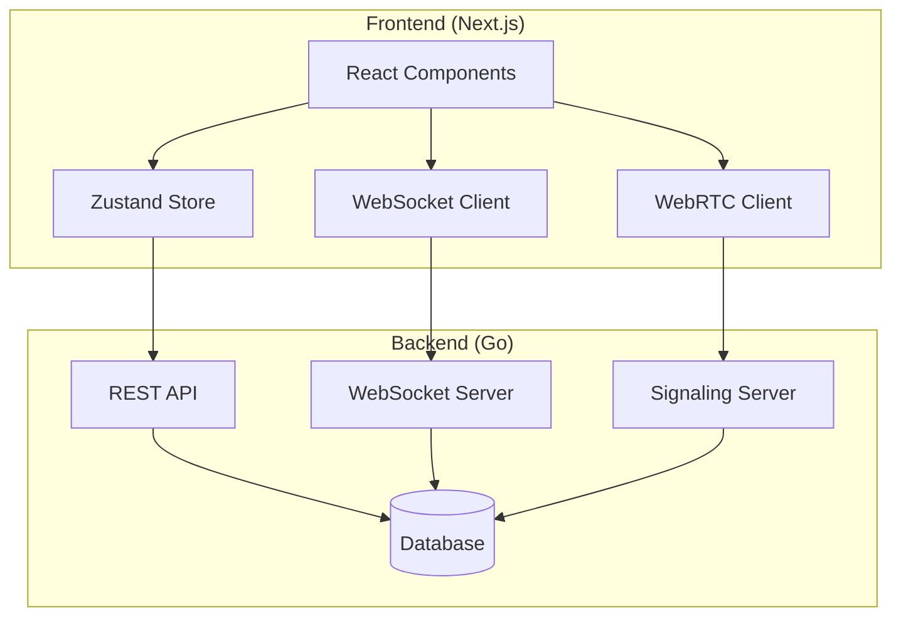

# Design Document

## Overview

The private messaging and voice calling feature enables real-time one-on-one communication between authenticated users, along with comprehensive friend management, global user search, and notification systems. The system consists of five main components: persistent message storage, real-time communication via WebSockets, peer-to-peer voice calling using WebRTC, friend relationship management, and centralized notification handling. The design leverages the existing authentication system and follows established patterns in the codebase.

## Architecture

### High-Level Architecture



### Communication Flow

1. **REST API**: CRUD operations for conversations, message history, user search, friend management, notifications
2. **WebSocket**: Real-time message delivery, typing indicators, presence updates, notifications, friend requests
3. **WebRTC**: Peer-to-peer voice communication with signaling server coordination

## Components and Interfaces

### Backend Components

#### Database Schema Extensions

**Conversation Entity**

```go
type Conversation struct {
    ID          string    `json:"id"`
    Participant1ID string `json:"participant1_id"`
    Participant2ID string `json:"participant2_id"`
    LastMessageAt  time.Time `json:"last_message_at"`
    CreatedAt   time.Time `json:"created_at"`
    UpdatedAt   time.Time `json:"updated_at"`
}
```

**Message Entity**

```go
type Message struct {
    ID             string    `json:"id"`
    ConversationID string    `json:"conversation_id"`
    SenderID       string    `json:"sender_id"`
    Content        string    `json:"content"`
    MessageType    string    `json:"message_type"` // text, call_start, call_end
    DeliveredAt    *time.Time `json:"delivered_at"`
    ReadAt         *time.Time `json:"read_at"`
    CreatedAt      time.Time `json:"created_at"`
}
```

**UserPresence Entity**

```go
type UserPresence struct {
    UserID       string    `json:"user_id"`
    Status       string    `json:"status"` // online, offline, in_call
    LastSeenAt   time.Time `json:"last_seen_at"`
    UpdatedAt    time.Time `json:"updated_at"`
}
```

**BlockedUser Entity**

```go
type BlockedUser struct {
    BlockerID  string    `json:"blocker_id"`
    BlockedID  string    `json:"blocked_id"`
    CreatedAt  time.Time `json:"created_at"`
}
```

**Friendship Entity**

```go
type Friendship struct {
    ID        string    `json:"id"`
    UserID    string    `json:"user_id"`
    FriendID  string    `json:"friend_id"`
    Status    string    `json:"status"` // pending, accepted, declined
    CreatedAt time.Time `json:"created_at"`
    UpdatedAt time.Time `json:"updated_at"`
}
```

**Notification Entity**

```go
type Notification struct {
    ID         string    `json:"id"`
    UserID     string    `json:"user_id"`
    Type       string    `json:"type"` // message, friend_request, call, system
    Title      string    `json:"title"`
    Content    string    `json:"content"`
    RelatedID  *string   `json:"related_id"` // conversation_id, user_id, etc.
    IsRead     bool      `json:"is_read"`
    CreatedAt  time.Time `json:"created_at"`
}
```

#### REST API Endpoints

**Conversation Management**

- `GET /api/conversations` - List user's conversations
- `POST /api/conversations` - Create/get conversation with user
- `DELETE /api/conversations/:id` - Delete conversation (user's view)
- `GET /api/conversations/:id/messages` - Get message history
- `POST /api/conversations/:id/messages` - Send message
- `PUT /api/conversations/:id/read` - Mark messages as read

**User Management**

- `GET /api/users/search?q=username` - Search users
- `POST /api/users/:id/block` - Block user
- `DELETE /api/users/:id/block` - Unblock user
- `GET /api/users/blocked` - List blocked users

**Call Management**

- `POST /api/calls/initiate` - Initiate call
- `POST /api/calls/:id/accept` - Accept call
- `POST /api/calls/:id/decline` - Decline call
- `POST /api/calls/:id/end` - End call

**Friend Management**

- `GET /api/friends` - List user's friends
- `GET /api/friends/requests` - List pending friend requests (sent/received)
- `POST /api/friends/request` - Send friend request
- `POST /api/friends/accept/:id` - Accept friend request
- `POST /api/friends/decline/:id` - Decline friend request
- `DELETE /api/friends/:id` - Remove friend

**Global Search**

- `GET /api/search/users?q=query` - Global user search with filters
- `GET /api/search/suggestions?q=query` - Real-time search suggestions

**Notification Management**

- `GET /api/notifications` - List user's notifications
- `PUT /api/notifications/:id/read` - Mark notification as read
- `PUT /api/notifications/read-all` - Mark all notifications as read
- `DELETE /api/notifications/:id` - Delete notification

#### WebSocket Server

**Connection Management**

```go
type WSConnection struct {
    UserID     string
    Conn       *websocket.Conn
    Send       chan []byte
    Hub        *Hub
}

type Hub struct {
    Clients    map[string]*WSConnection
    Broadcast  chan []byte
    Register   chan *WSConnection
    Unregister chan *WSConnection
}
```

**Message Types**

```go
type WSMessage struct {
    Type    string      `json:"type"`
    Payload interface{} `json:"payload"`
}

// Message types: message, typing, presence, call_request, call_response, notification, friend_request
```

**Real-time Notification System**

```go
type NotificationPayload struct {
    NotificationID string `json:"notification_id"`
    Type          string `json:"type"` // message, friend_request, call, system
    Title         string `json:"title"`
    Content       string `json:"content"`
    RelatedID     string `json:"related_id,omitempty"`
    CreatedAt     string `json:"created_at"`
}

type FriendRequestPayload struct {
    RequestID    string `json:"request_id"`
    SenderID     string `json:"sender_id"`
    SenderName   string `json:"sender_name"`
    SenderAvatar string `json:"sender_avatar,omitempty"`
    Action       string `json:"action"` // sent, accepted, declined
    CreatedAt    string `json:"created_at"`
}
```

#### Real-time Notification Service

**Notification Broadcasting**

```go
type NotificationService struct {
    hub *Hub
    db  *ent.Client
}

func (ns *NotificationService) SendNotification(userID string, notification *Notification) error {
    // Store notification in database
    // Send via WebSocket if user is online
    // Queue for push notification if user is offline
}

func (ns *NotificationService) BroadcastFriendRequest(senderID, receiverID string, action string) error {
    // Create friend request notification
    // Send real-time update to both users
    // Update friend request status
}
```

**WebSocket Notification Handlers**

```go
func (h *Hub) HandleNotification(conn *WSConnection, message WSMessage) {
    switch message.Type {
    case "notification_read":
        // Mark notification as read
        // Broadcast read status update
    case "friend_request_response":
        // Handle accept/decline friend request
        // Notify sender of response
        // Update friendship status
    }
}
```

#### WebRTC Signaling Server

**Signaling Messages**

```go
type SignalingMessage struct {
    Type         string `json:"type"` // offer, answer, ice-candidate
    FromUserID   string `json:"from_user_id"`
    ToUserID     string `json:"to_user_id"`
    CallID       string `json:"call_id"`
    SDP          string `json:"sdp,omitempty"`
    ICECandidate string `json:"ice_candidate,omitempty"`
}
```

### Frontend Components

#### Zustand Store Extensions

**Messaging Store**

```typescript
interface MessagingState {
  conversations: Conversation[];
  activeConversation: string | null;
  messages: Record<string, Message[]>;
  unreadCounts: Record<string, number>;
  typingUsers: Record<string, string[]>;
  onlineUsers: Set<string>;

  // Actions
  setConversations: (conversations: Conversation[]) => void;
  addMessage: (conversationId: string, message: Message) => void;
  markAsRead: (conversationId: string) => void;
  setTyping: (
    conversationId: string,
    userId: string,
    isTyping: boolean
  ) => void;
  setUserOnline: (userId: string, isOnline: boolean) => void;
}
```

**Call Store**

```typescript
interface CallState {
  activeCall: Call | null;
  incomingCall: Call | null;
  callStatus: "idle" | "calling" | "ringing" | "connected" | "ended";
  isMuted: boolean;
  volume: number;

  // Actions
  initiateCall: (userId: string) => void;
  acceptCall: (callId: string) => void;
  declineCall: (callId: string) => void;
  endCall: () => void;
  toggleMute: () => void;
  setVolume: (volume: number) => void;
}
```

**Friend Store**

```typescript
interface FriendState {
  friends: User[];
  friendRequests: {
    sent: FriendRequest[];
    received: FriendRequest[];
  };
  searchResults: User[];
  isSearching: boolean;

  // Actions
  loadFriends: () => void;
  loadFriendRequests: () => void;
  sendFriendRequest: (userId: string) => void;
  acceptFriendRequest: (requestId: string) => void;
  declineFriendRequest: (requestId: string) => void;
  removeFriend: (friendId: string) => void;
  searchUsers: (query: string) => void;
}
```

**Notification Store**

```typescript
interface NotificationState {
  notifications: Notification[];
  unreadCount: number;
  isLoading: boolean;

  // Actions
  loadNotifications: () => void;
  markAsRead: (notificationId: string) => void;
  markAllAsRead: () => void;
  deleteNotification: (notificationId: string) => void;
  addNotification: (notification: Notification) => void;
}
```

#### React Components

**ConversationList Component**

- Displays list of conversations with last message preview
- Shows unread message counts
- Handles conversation selection

**ChatWindow Component**

- Message display with infinite scroll for history
- Message input with typing indicators
- Call initiation button
- Online status display

**CallInterface Component**

- Incoming call notification
- Active call controls (mute, volume, end call)
- Connection quality indicators

**FriendList Component**

- Display list of friends with online status
- Friend request management (sent/received)
- Friend removal and blocking options

**GlobalSearch Component**

- Prominent search bar with real-time suggestions
- User search results with profile previews
- Action buttons (message, add friend, view profile)

**NotificationCenter Component**

- Centralized notification list with categorization
- Mark as read/unread functionality
- Navigation to related content

#### WebSocket Client

**Connection Management**

```typescript
class WebSocketClient {
  private ws: WebSocket | null = null;
  private reconnectAttempts = 0;
  private maxReconnectAttempts = 5;

  connect(token: string): void;
  disconnect(): void;
  sendMessage(message: WSMessage): void;
  onMessage(callback: (message: WSMessage) => void): void;
  private handleReconnect(): void;
}
```

**Real-time Notification Handling**

```typescript
interface WSNotificationMessage {
  type: "notification" | "friend_request";
  payload: NotificationPayload | FriendRequestPayload;
}

class NotificationWebSocketHandler {
  constructor(
    private notificationStore: NotificationStore,
    private friendStore: FriendStore
  ) {}

  handleMessage(message: WSNotificationMessage): void {
    switch (message.type) {
      case "notification":
        this.notificationStore.addNotification(
          message.payload as NotificationPayload
        );
        break;
      case "friend_request":
        this.handleFriendRequest(message.payload as FriendRequestPayload);
        break;
    }
  }

  private handleFriendRequest(payload: FriendRequestPayload): void {
    // Update friend store with new request
    // Show real-time notification
    // Update UI badges and counters
  }
}
```

#### WebRTC Client

**Peer Connection Management**

```typescript
class WebRTCClient {
  private peerConnection: RTCPeerConnection | null = null;
  private localStream: MediaStream | null = null;
  private remoteStream: MediaStream | null = null;

  async initializeCall(isInitiator: boolean): Promise<void>;
  async createOffer(): Promise<RTCSessionDescriptionInit>;
  async createAnswer(
    offer: RTCSessionDescriptionInit
  ): Promise<RTCSessionDescriptionInit>;
  async handleAnswer(answer: RTCSessionDescriptionInit): void;
  async addIceCandidate(candidate: RTCIceCandidateInit): void;
  endCall(): void;
}
```

## Data Models

### TypeScript Interfaces

```typescript
interface User {
  id: string;
  name: string;
  username: string;
  avatar_url?: string;
  email: string;
  bio?: string;
}

interface Conversation {
  id: string;
  participant1: User;
  participant2: User;
  last_message?: Message;
  last_message_at: string;
  unread_count: number;
  created_at: string;
}

interface Message {
  id: string;
  conversation_id: string;
  sender: User;
  content: string;
  message_type: "text" | "call_start" | "call_end";
  delivered_at?: string;
  read_at?: string;
  created_at: string;
}

interface Call {
  id: string;
  caller: User;
  callee: User;
  status: "pending" | "accepted" | "declined" | "ended";
  started_at?: string;
  ended_at?: string;
}

interface UserPresence {
  user_id: string;
  status: "online" | "offline" | "in_call";
  last_seen_at: string;
}

interface FriendRequest {
  id: string;
  sender: User;
  receiver: User;
  status: "pending" | "accepted" | "declined";
  created_at: string;
  updated_at: string;
}

interface Notification {
  id: string;
  user_id: string;
  type: "message" | "friend_request" | "call" | "system";
  title: string;
  content: string;
  related_id?: string;
  is_read: boolean;
  created_at: string;
}
```

## Error Handling

### Backend Error Handling

**Database Errors**

- Connection failures: Retry with exponential backoff
- Constraint violations: Return appropriate HTTP status codes
- Transaction failures: Rollback and return error

**WebSocket Errors**

- Connection drops: Client-side reconnection logic
- Message delivery failures: Store and retry mechanism
- Authentication failures: Force re-authentication

**WebRTC Errors**

- ICE connection failures: Fallback to TURN servers
- Media access denied: Graceful degradation
- Signaling failures: Retry mechanism

### Frontend Error Handling

**Network Errors**

- API failures: Toast notifications with retry options
- WebSocket disconnections: Automatic reconnection
- WebRTC failures: User-friendly error messages

**State Management Errors**

- Invalid state transitions: Reset to safe state
- Data synchronization issues: Refresh from server

## Component Architecture

### Frontend Component Structure

Based on the modular UI refactoring, the components are organized as follows:

**Messaging Components**

- `ConversationList` - Main conversation list with search functionality
- `ChatWindow` - Message display and input interface
- `UserProfile` - User information and status display
- `NavigationSection` - Messaging navigation controls

**Chat Window Sub-components**

- `ChatHeader` - Conversation header with user info and call controls
- `MessageList` - Scrollable message display with pagination
- `MessageItem` - Individual message rendering
- `ChatInput` - Message composition and sending
- `TypingIndicator` - Real-time typing status display

**Conversation List Sub-components**

- `ConversationItem` - Individual conversation preview
- `ConversationListHeader` - List header with controls
- `UserSearchModal` - User search and selection interface

**Friend Management Components**

- `FriendList` - Display friends with online status and management options
- `FriendRequestList` - Manage sent and received friend requests
- `AddFriendModal` - Interface for sending friend requests

**Search Components**

- `GlobalSearchBar` - Prominent search interface with suggestions
- `SearchResults` - Display user search results with actions
- `SearchSuggestions` - Real-time search suggestions dropdown

**Notification Components**

- `NotificationList` - Centralized notification display
- `NotificationItem` - Individual notification rendering
- `NotificationBadge` - Unread count indicators

**Shared Components**

- `UserAvatar` - Consistent user avatar display
- `MessagePreview` - Message preview formatting
- `EmptyState` - Empty state handling
- `LoadingSpinner` - Loading state indicators
- `MessageSkeleton` - Loading skeleton for messages

## Security Considerations

### Authentication & Authorization

- JWT token validation for all WebSocket connections
- User permission checks for conversation access
- Rate limiting for message sending and call initiation

### Data Protection

- Message content encryption in transit (WSS/HTTPS)
- Sensitive data masking in logs
- User blocking enforcement at API level

### WebRTC Security

- STUN/TURN server authentication
- ICE candidate validation
- Media stream access permissions

## Performance Optimizations

### Database Optimizations

- Indexes on conversation participants and message timestamps
- Message pagination to limit query size
- Connection pooling for concurrent requests

### Real-time Optimizations

- WebSocket connection pooling
- Message batching for high-frequency updates
- Presence update debouncing

### Frontend Optimizations

- Virtual scrolling for large message lists
- Message caching with TTL
- Lazy loading of conversation history
- WebRTC connection reuse where possible
